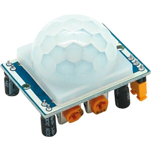
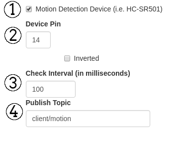

# HC-SR501 Motion Sensor Module

## Example  Module


## Config Settings in Webinterface:


The GPIO numbering scheme are the BCM GPIO Pins not the Physical numbering.

**Note:** HIGH level is about 3,3V and the most boards are not 5V tolerant.

### 1. Motion Detection Device

If this checkbox is checked the Motion Sensor Periphery Module is activated and the other options are shown.

### 2. Device Pin

Here you define the GPIO pin where you connected the Motion Sensor Module

Also the checkbox for "Active Low" triggered motion sensor modules could be enabled here. If this box is checked the ON state for the relay is a LOW signal.

### 3. Check Interval (in milliseconds)

Here you can define the time in which the motion sensing occurs. The default value is 100ms which triggers a check of the motion sensor 10 times a second.

### 4. Publish Topic

In this textbox you define the MQTT publish topic in which the motions will be published if they occur. Message will be 1 if motion occurs.


## Config File Settings

Config File: **.periph_settings.conf**

```json
{
  "peripherals": {
    "timer_delay": 60000,
    "motion": {
      "enabled": true,
      "inverted": false,
      "pin": 14,
      "interval": 100,
      "topic": "client/motion"
    },
    [...]
  }
}
```
