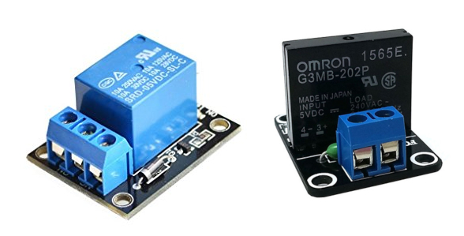
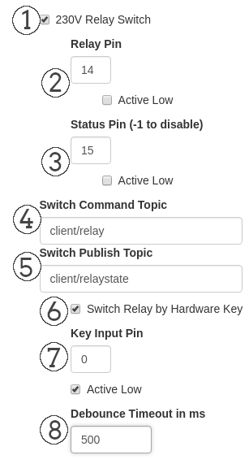

# Relay Module

## Exampe Relay Modules


## Config Settings in Webinterface:


The GPIO numbering scheme are the BCM GPIO Pins not the Physical numbering.

**Note:** This HIGH level is about 3,3V and the most boards are not 5V tolerant.

### 1. 230V Relay Switch

If this checkbox is checked the Relay Periphery Module is activated
and the other options are shown.

### 2. Relay Pin

Here you define the GPIO pin where you connected the Relay Module

Also the checkbox for "Active Low" triggered relay modules could be enabled here. If this box is checked the ON state for the relay is a LOW signal.

### 3. Status Pin

Here you can define a status pin where you can attach a LED or as feedback line for othe purposes. You can disable it if you use *-1* as GPIO Pin.

Also a checkbox to invert the logic of the status pin. On checked state it deliver a LOW signal if the relay is in ON state.

### 4. Switch Command Topic

In this textbox you define the MQTT command topic which will be subscribed and on which the relay should react to. 

If you send an "Off", "On" or "0", "1" message to the topic it will change the relay to the defined state.

### 5. Switch Publish Topic

In this textbox you define the MQTT publish topic where the current state of the relay will be published immediately on every change.

Holds 0 for Off state and 1 for an On state of the relay.

### 6. Switch Relay by Hardware Key

If this checkbox is checked you can also attach a hardware switch to toggle the relay.

### 7. Key Input Pin

If you enabled the checkbox above you can here define the GPIO pin where you connected a hardware switch.

Also a checkbox for inverted logic of the hardware switch. If checked the relay goes to On state if the switch send a LOW signal.

### 8. Debounce Timeout in ms

To debounce your hardware switch you can finetune the debouncing time here. It defaults to 500ms which are ok for most purposes.


## Config File Settings

Config File: **.periph_settings.conf**

```json
{
  "peripherals": {
    "timer_delay": 60000,
    "relay": {
      "enabled": true,
      "pin": 14,
      "inverted": false,
      "keyinput": true,
      "status_pin": 15,
      "status_invert": false,
      "keyinput_debounce": 500,
      "keyinput_invert": true,
      "keyinput_pin": 0,
      "topic_pub": "client/relaystate",
      "topic_cmd": "client/relay"
    },
    [...]
  }
}
```
